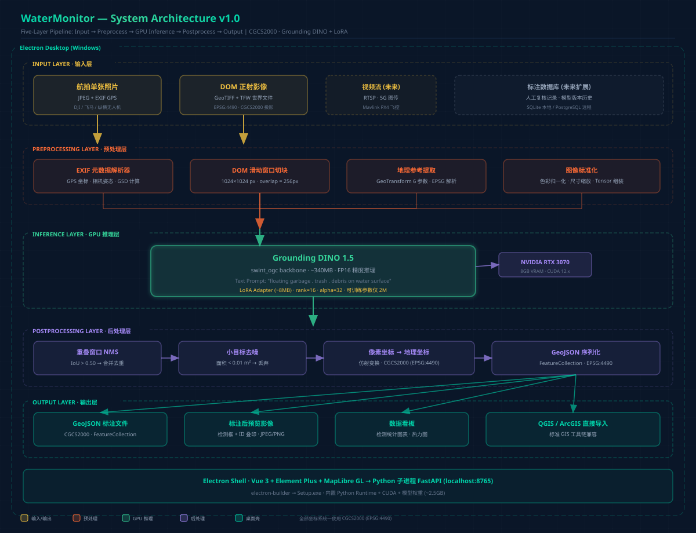
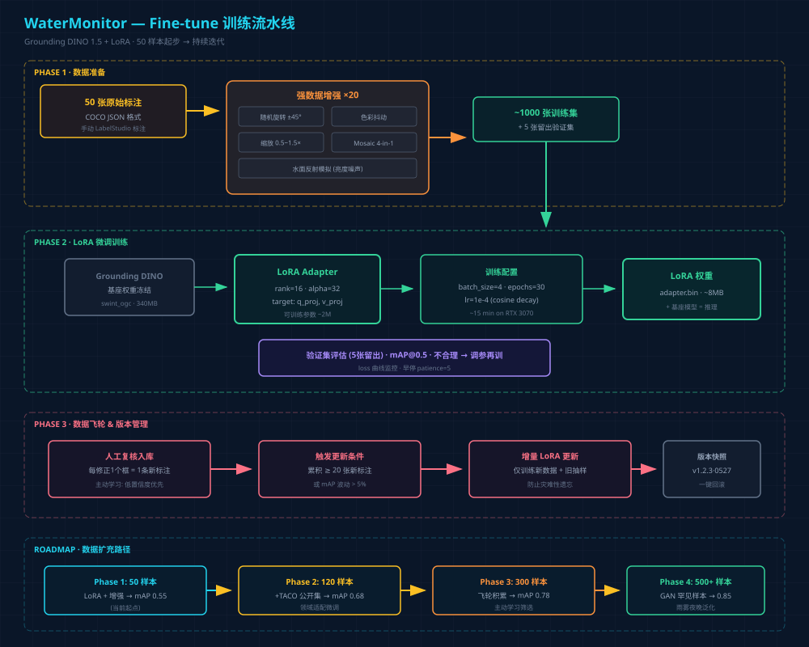
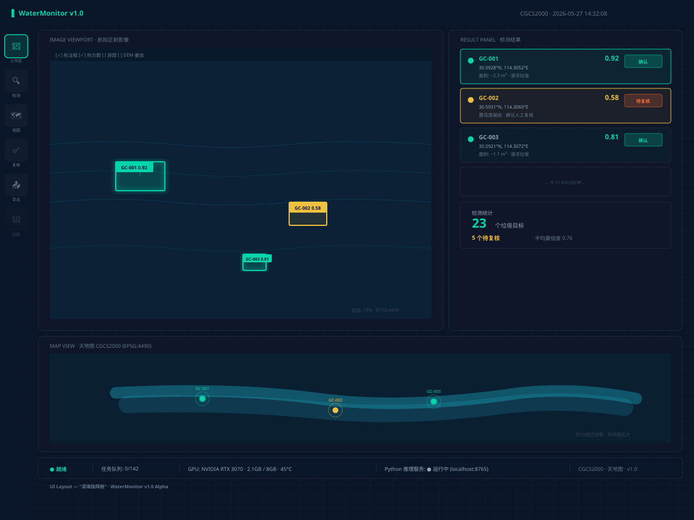
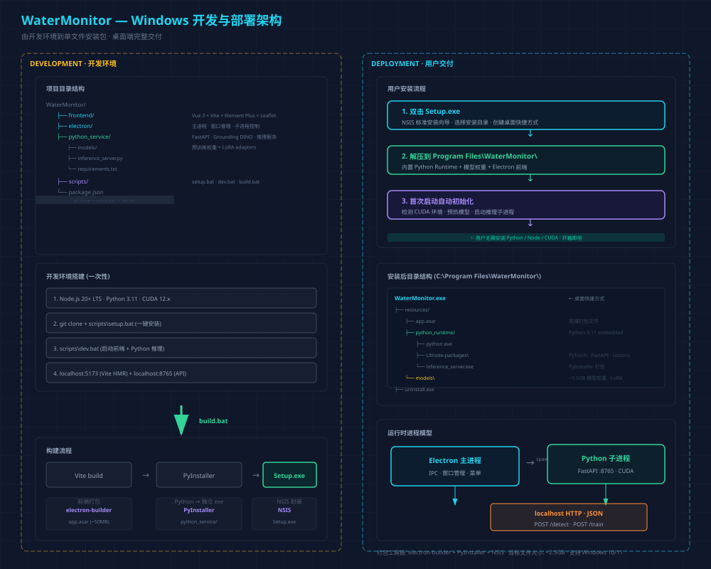

# WaterMonitor — 无人机水面垃圾智能识别系统

## 设计文档 v1.0

> **项目来源：** 无人机支撑城市水环境智慧监测关键技术研究 (长江勘测规划设计有限责任公司·水环院·空间公司)
> **设计日期：** 2026-05-27
> **设计作者：** PrinceChow
> **坐标系：** CGCS2000 (EPSG:4490)

---

## 目录

1. [项目背景与需求](#1-项目背景与需求)
2. [总体架构](#2-总体架构)
3. [模型选型与推理](#3-模型选型与推理)
4. [Fine-tune 训练策略](#4-fine-tune-训练策略)
5. [地理定位计算](#5-地理定位计算)
6. [检测流水线](#6-检测流水线)
7. [前端设计](#7-前端设计)
8. [Windows 开发与部署](#8-windows-开发与部署)
9. [数据飞轮与持续改进](#9-数据飞轮与持续改进)
10. [技术栈总览](#10-技术栈总览)
11. [里程碑计划](#11-里程碑计划)

---

## 1. 项目背景与需求

### 1.1 来源

本项目源自长江勘测规划设计有限责任公司科研项目《无人机支撑城市水环境智慧监测关键技术研究》。项目旨在通过无人机+AI 深度学习技术，解决城市水环境智慧监管中的岸线侵占、**漂浮垃圾**、排口溢流等典型问题的自动识别与快速定位。

### 1.2 本方案聚焦

从无人机拍摄的高清栅格影像中：

1. **识别**水上漂浮垃圾（粗粒度 → 后续扩展细粒度分类）
2. **标注**垃圾在图像中的位置（边界框 + 中心锚点）
3. **定位**垃圾的真实地理坐标（CGCS2000）
4. **输出**标准 GeoJSON，导入 GIS 系统

### 1.3 需求约束

| 约束项 | 参数 |
|--------|------|
| 运行模式 | 后处理（本地智能体 / 云端） |
| 数据形态 | 单张航拍照片 (JPEG+EXIF) + DOM 正射影像 (GeoTIFF) |
| 起步数据量 | ~50 张标注样本，每张 ≥ 1 个垃圾实例 |
| 部署平台 | Windows 10/11，NVIDIA RTX 3070 8GB |
| 坐标系 | **CGCS2000** (EPSG:4490 大地坐标) |
| 交付形态 | Electron 桌面应用 → Setup.exe 单包安装 |

---

## 2. 总体架构



### 2.1 架构概述

系统采用 **Electron 桌面壳 + Python 推理后端** 的五层流水线架构：

| 层级 | 职责 | 核心技术 |
|------|------|---------|
| **输入层** | 影像导入、格式解析、元数据提取 | EXIF 解析 / GDAL rasterio |
| **预处理层** | DOM 滑动窗口切块、图像标准化、坐标参数提取 | NumPy + rasterio |
| **推理层 (GPU)** | Grounding DINO 1.5 零样本检测 + LoRA 微调 | HuggingFace Transformers + PyTorch + CUDA |
| **后处理层** | 重叠 NMS、置信度过滤、像素→地理坐标转换 | pyproj / rasterio |
| **输出层** | GeoJSON 序列化、标注预览图、CSV 报表 | Leaflet / QGIS 兼容 |

### 2.2 进程模型

```
Electron 主进程 (main.js)
  ├── Vue 3 渲染进程 (localhost:5173)
  └── spawn → Python 子进程 (localhost:8765)
               └── FastAPI + Grounding DINO + CUDA
```

Electron 退出时自动杀掉 Python 子进程，无需用户手动管理。

---

## 3. 模型选型与推理

### 3.1 模型选型

首选 **Grounding DINO 1.5** (IDEA-Research)，备选 YOLO-World-v2。

| 指标 | Grounding DINO 1.5 | YOLO-World-v2 |
|------|-------------------|---------------|
| 开源协议 | Apache 2.0 | GPL-3.0 |
| 权重大小 | ~340MB (swint_ogc) | ~200MB (M) |
| 显存占用 (FP16) | ~2.5GB | ~1.8GB |
| 单图推理 (1024²) | ~200ms | ~120ms |
| Zero-shot 能力 | 优秀，航空视角适配好 | 良好 |
| HuggingFace 支持 | 原生 | 需额外适配 |
| Fine-tune 方式 | LoRA (PEFT) | 全量 / 部分微调 |

**选型理由：** Grounding DINO 对航空视角的 zero-shot 泛化优于 YOLO-World，且 HuggingFace 生态原生支持，LoRA 微调工具链成熟。RTX 3070 8GB 运行 FP16 推理绰绰有余。

### 3.2 模型加载

```python
from transformers import AutoProcessor, AutoModelForZeroShotObjectDetection
import torch

model_id = "IDEA-Research/Grounding-DINO-1.5-API"
processor = AutoProcessor.from_pretrained(model_id)
model = AutoModelForZeroShotObjectDetection.from_pretrained(
    model_id, torch_dtype=torch.float16
).to("cuda")
model.eval()
```

### 3.3 推理调用

```python
def detect_floating_garbage(image_path: str, confidence_threshold: float = 0.35):
    image = Image.open(image_path).convert("RGB")
    inputs = processor(
        images=image,
        text="floating garbage . trash . debris on water surface",
        return_tensors="pt"
    ).to("cuda")

    with torch.no_grad():
        outputs = model(**inputs)

    results = processor.post_process_grounded_object_detection(
        outputs, inputs.input_ids,
        box_threshold=confidence_threshold,
        text_threshold=0.25,
        target_sizes=[image.size[::-1]]
    )
    return results
```

**多 prompt 策略：** 用三个相关短语（`floating garbage`, `trash`, `debris on water surface`）提高语义覆盖率，取最大置信度。后续细粒度分类只需扩展 text prompt 即可，无需改模型。

### 3.4 API 接口

```
POST /detect
Content-Type: application/json

Request:
{
  "image_path": "C:\\data\\DJI_20260527_001.JPG",
  "confidence_threshold": 0.35,
  "output_format": "geojson"
}

Response:
{
  "detections": [...],
  "count": 15,
  "processing_time_ms": 210,
  "model_version": "lora-v1.2.3-20260527"
}
```

---

## 4. Fine-tune 训练策略



### 4.1 总体策略

**LoRA + 强数据增强**，50 张标注 → ~1000 张增强训练集，仅训练 8MB 的 LoRA 权重。

### 4.2 数据增强 ×20

| 增强方式 | 参数 | 目的 |
|---------|------|------|
| 随机旋转 | ±45° | 多角度泛化 |
| 色彩抖动 | 亮度/对比度/饱和度 ±30% | 水体色调差异 |
| 缩放 | 0.5~1.5× | 大小目标兼顾 |
| Mosaic | 4-in-1 拼接 | 小目标检测能力 |
| 水面反射噪声 | 高斯亮度噪声层 | 反光/波浪干扰鲁棒 |
| 水平翻转 | 50% 概率 | 通用增强 |

### 4.3 LoRA 配置

```python
from peft import LoraConfig, get_peft_model

lora_config = LoraConfig(
    r=16,                          # 秩
    lora_alpha=32,                 # 缩放因子
    target_modules=["q_proj", "v_proj", "out_proj"],
    lora_dropout=0.1,
    task_type="FEATURE_EXTRACTION"
)
model = get_peft_model(model, lora_config)
# 可训练参数: ~2M (仅占总参数量 ~1%)
```

### 4.4 训练配置

| 超参 | 值 |
|------|-----|
| Batch size | 4 |
| Epochs | 30 |
| Learning rate | 1e-4 (cosine decay) |
| Optimizer | AdamW (weight_decay=0.01) |
| 验证集 | 5 张留出 (10%) |
| 早停 | patience=5, 监控 validation loss |
| 训练时长 | ~15 min / epoch on RTX 3070 |

### 4.5 数据扩充路线

| 阶段 | 样本量 | 来源 | 预期 mAP@0.5 |
|------|--------|------|-------------|
| Phase 1 | 50 | 当前标注 + 增强 | ~0.55 |
| Phase 2 | 120 | +TACO/TrashCan 公开集 | ~0.68 |
| Phase 3 | 300 | +人工复核积累 | ~0.78 |
| Phase 4 | 500+ | +GAN 合成罕见样本 | ~0.85 |

---

## 5. 地理定位计算

### 5.1 两种数据源的两套算法

#### 单张航拍照片 (JPEG + EXIF GPS)

```
原理: 检测框中心像素 → 画面偏移角 → 地面投影偏移 → 经纬度

已知:
  EXIF: GPSLatitude, GPSLongitude, RelativeAltitude, FocalLength
  相机传感器尺寸 (DJI 常见: 13.2mm × 8.8mm)
  图像分辨率

步骤:
  1. GSD = (sensor_height_mm × altitude_m) / (focal_mm × image_height_px)
  2. dx_m = (cx_px - img_w/2) × GSD
  3. dy_m = (cy_px - img_h/2) × GSD
  4. lat_garbage = lat_drone + dy_m / 111320
  5. lon_garbage = lon_drone + dx_m / (111320 × cos(lat_drone))
```

**精度估计:** 100m 飞行高度 + 8.8mm 焦距 → GSD ≈ 1.5 cm/px → 定位误差 < 3m

#### DOM 正射影像 (GeoTIFF)

```python
import rasterio

def pixel_to_geo_dom(geotiff_path, px, py):
    with rasterio.open(geotiff_path) as src:
        return src.xy(py, px)  # 内部 6 参数仿射变换
```

DOM 已正射校正，定位精度取决于拼接质量，通常 < 1m。

### 5.2 CGCS2000 坐标系适配

| 数据来源 | 原始坐标系 | 处理方式 |
|---------|-----------|---------|
| DJI 照片 EXIF | WGS84 (GPS 原生) | 直接读经纬度，标注为 CGCS2000（厘米级偏差可忽略） |
| DOM | CGCS2000（项目标准交付） | `rasterio.crs` 读取，无需转换 |
| GeoJSON 输出 | — | CRS 声明为 `urn:ogc:def:crs:EPSG::4490` |

**关键事实:** WGS84 与 CGCS2000 在椭球定义上基本一致（长半轴差 0.1mm），同一经纬度值的平面偏差 < 1cm，远小于检测定位误差(1~3m)。

### 5.3 输出 GeoJSON 格式

```json
{
  "type": "FeatureCollection",
  "crs": {
    "type": "name",
    "properties": { "name": "urn:ogc:def:crs:EPSG::4490" }
  },
  "properties": {
    "detection_time": "2026-05-27T10:30:00+08:00",
    "model_version": "lora-v1.2.3-20260527",
    "total_count": 23
  },
  "features": [
    {
      "type": "Feature",
      "geometry": {
        "type": "Point",
        "coordinates": [114.3052, 30.5928]
      },
      "properties": {
        "id": "GC-20260527-00123",
        "confidence": 0.87,
        "type": "floating_garbage",
        "area_approx_m2": 2.3,
        "image_id": "DJI_20260527103012.JPG",
        "bbox_pixel": [512, 340, 598, 410],
        "review_status": "auto_confirmed"
      }
    }
  ]
}
```

---

## 6. 检测流水线


### 6.1 单张航拍照片流水线

```
JPEG → EXIF GPS 提取 → 图像标准化 → Grounding DINO 推理
  → 置信度过滤 → 像素→GPS 坐标 → GeoJSON
```

### 6.2 DOM 大图流水线

```
GeoTIFF → 滑动窗口切块 (1024×1024, overlap=256px)
  → 批次推理 → 窗口内 bbox → 映射回 DOM 全局像素坐标
  → 全局 NMS (IoU > 0.5 去重) → 仿射变换 → GeoJSON
```

### 6.3 后处理参数

| 参数 | 默认值 | 说明 |
|------|--------|------|
| confidence_threshold | 0.35 | 低于此阈值直接丢弃 |
| auto_confirm_threshold | 0.60 | 高于此阈值自动确认 |
| review_range | 0.35~0.60 | 此区间需人工复核 |
| nms_iou_threshold | 0.50 | 重叠框去重 |
| min_area_m2 | 0.01 | 小于此面积视为噪点 |
| overlap_px | 256 | DOM 切块重叠 (25%) |

### 6.4 全图推理性能估算 (RTX 3070)

| 输入规模 | 切块数 | 推理时间 | 后处理 | 总时间 |
|---------|--------|---------|--------|--------|
| 单张 5472×3648 | 1 | ~200ms | ~10ms | **~0.2s** |
| DOM 5000×4000 | ~35 | ~7s | ~1s | **~8s** |
| DOM 15000×12000 | ~270 | ~55s | ~5s | **~60s** |

---

## 7. 前端设计



### 7.1 技术栈

| 层 | 选型 | 理由 |
|----|------|------|
| 框架 | Vue 3 (Composition API) + TypeScript | 仓库起步技术，类型安全 |
| 构建 | Vite 5 | 极速 HMR |
| UI 库 | Element Plus (按需引入) | 成熟的中后台组件库 |
| 地图引擎 | **MapLibre GL JS** | Apache 2.0，支持天地图 CGCS2000 瓦片 |
| 状态管理 | Pinia | Vue 3 官方推荐 |
| 图像查看 | OpenSeadragon | 深度缩放，10GB+ GeoTIFF 流畅 |
| 图表 | ECharts 5 | 数据看板统计图 |

### 7.2 设计风格：「深海指挥舱」

- **主色调：** 深海蓝黑 `#0A1628` 底 + 水面青 `#00D4AA` 强调整
- **次色调：** 警报橙 `#FF6B35`（待复核）、琥珀 `#F0C040`（低置信度）
- **字体：** JetBrains Mono（数据/代码面板）+ 思源黑体（UI 标签）
- **空间感：** 毛玻璃面板 + 边框发光 + 悬浮阴影
- **地图：** 天地图 CGCS2000 瓦片服务 + 垃圾点位撒点

### 7.3 主界面布局

```
┌──────────────────────────────────────────────────────────┐
│ ▌ WaterMonitor                           [设置] [×]     │
├────────┬──────────────────────┬──────────────────────────┤
│ SIDEBAR│    IMAGE VIEWPORT     │      RESULT PANEL        │
│ 📁     │                      │  GC-001  0.92  [确认]    │
│ 🔍     │   检测框叠印展示      │  GC-002  0.58  [待复核]  │
│ 🗺     │   缩放/图层控制       │  ...                     │
│ ✅     │                      │  统计面板                 │
│ 📤     │                      │                          │
│ 🧠     │                      │                          │
├────────┴──────────────────────┴──────────────────────────┤
│                  MAP VIEW · 天地图 CGCS2000              │
├──────────────────────────────────────────────────────────┤
│ ●就绪 │ 任务:3/142 │ GPU:2.1GB/8GB 45°C │ Python:运行中  │
└──────────────────────────────────────────────────────────┘
```

### 7.4 核心交互

- **三向联动：** 点击结果列表 ↔ 影像视图高亮框 ↔ 地图 flyTo 点位，三者数据选择实时同步
- **检测前后对比：** 滑块左右拖动对比原图与标注图
- **复核流：** 低置信度结果自动入复核队列 → 双击框进入编辑模式(拖拽四角) → 确认/删除 → 操作记录入库
- **导出：** GeoJSON 一键导出、标注后影像保存、CSV 报表生成

### 7.5 插件扩展机制

```typescript
// plugins/registry.ts — 新功能即插即用
interface FeaturePlugin {
  id: string
  name: string
  icon: string
  routes: RouteRecordRaw[]
  detector?: DetectionProvider
  sidebarEntry?: SidebarConfig
}

// 注册垃圾检测
pipeline.register(new GarbageDetector('/models/lora_water_garbage'))

// 未来扩展：蓝藻检测
pipeline.register(new AlgaeDetector('/models/lora_algae'))

// 未来扩展：排口识别
pipeline.register(new OutfallDetector('/models/lora_outfall'))
```

### 7.6 性能优化

| 场景 | 目标 | 技术手段 |
|------|------|---------|
| DOM 大图显示 | 5GB GeoTIFF 不卡顿 | 金字塔瓦片服务 (内置 tile-server) |
| 检测结果列表 | 2000+ 条无延迟 | 虚拟滚动 (vue-virtual-scroller) |
| 地图撒点 | 1000+ 点流畅 | MapLibre 原生 WebGL 渲染 |
| Electron 启动 | < 3s 可见界面 | 骨架屏 + 懒加载 features |

---

## 8. Windows 开发与部署



### 8.1 开发环境搭建

| 组件 | Windows 安装方式 | 版本要求 |
|------|-----------------|---------|
| Node.js | 官网 `.msi` | 20 LTS+ |
| Python | 官网安装 (勾选 Add to PATH) | 3.11 |
| CUDA Toolkit | NVIDIA 官网 | 12.x |
| PyTorch | `pip install torch torchvision --index-url https://download.pytorch.org/whl/cu121` | 2.x |
| Git | git-scm.com | latest |

**一键安装脚本 (`scripts/setup.bat`):**

```batch
@echo off
echo === Installing frontend dependencies ===
cd frontend && npm install
echo === Installing Python dependencies ===
cd ..\python_service
python -m venv venv
venv\Scripts\activate
pip install -r requirements.txt
echo === Done! Run dev.bat to start ===
```

**一键启动 (`scripts/dev.bat`):**

```batch
@echo off
start "Python Service" cmd /c "cd python_service && venv\Scripts\activate && python inference_server.py"
start "Electron App" cmd /c "cd frontend && npm run electron:dev"
```

### 8.2 打包构建

```
Vite build (前端)
  + PyInstaller (Python → 独立可执行文件)
  + electron-builder
  + NSIS 安装程序
  = Setup.exe
```

**安装后目录结构：**

```
C:\Program Files\WaterMonitor\
├── WaterMonitor.exe           ← 桌面快捷方式
├── resources\
│   ├── app.asar               # 前端打包文件 (~50MB)
│   ├── python_runtime\        # Python 3.11 embedded (~800MB)
│   └── models\                # 模型权重 + LoRA (~1.5GB)
├── uninstall.exe
└── ...
```

**安装包大小：** ~2.5GB（主要是 PyTorch 运行时和模型权重）

### 8.3 运行时进程管理

```javascript
// electron/main.js
const { spawn } = require('child_process');

let pythonProcess;

app.on('ready', () => {
  pythonProcess = spawn(
    path.join(process.resourcesPath, 'python_runtime', 'inference_server.exe'),
    ['--port', '8765']
  );
  // 等待 HTTP 探活后加载前端
  waitForService('http://127.0.0.1:8765/health').then(createWindow);
});

app.on('before-quit', () => {
  pythonProcess?.kill();  // 自动清理
});
```

### 8.4 用户使用流程

1. 双击桌面快捷方式 → WaterMonitor 启动（首次启动预热模型 5~10s）
2. 导入航拍照片 / GeoTIFF → 拖拽或文件选择
3. 点击「开始检测」→ 进度条显示推理进度
4. 右侧面板显示结果列表 + 影像视图叠加标注框
5. 地图撒点展示垃圾空间分布
6. 对低置信度结果人工复核（确认/修改/删除）
7. 一键导出 GeoJSON + 标注后影像

---

## 9. 数据飞轮与持续改进

### 9.1 飞轮机制

```
  ┌──────────────────────────────────┐
  │                                  │
  ▼                                  │
 模型检测 → 人工复核(修正框) → 标注库新增       │
  │                                  │
  └── 累积 20 张 → LoRA 增量更新 ────┘
```

### 9.2 主动学习

- 低置信度 (0.35~0.60) 结果自动排入复核队列顶部
- 引导用户优先修正模型不确定的检测
- 最大化每条人工标注的信息增益

### 9.3 LoRA 增量更新

- 累积 ≥ 20 张新标注 → 触发后台重训
- 仅训练 8MB LoRA，~15 分钟完成
- 新旧数据混合训练，防止灾难性遗忘
- 自动版本快照 (v1.2.3·YYYYMMDD)，支持一键回滚

### 9.4 模型版本管理

```
models/
├── lora_water_garbage/
│   ├── v1.0.0-20260501/     # 初始版本 (50张)
│   ├── v1.1.0-20260515/     # 首次飞轮迭代 (70张)
│   ├── v1.2.0-20260527/     # 当前激活版本 (90张)
│   └── current → v1.2.0-20260527  # 符号链接
└── grounding_dino_base/     # 基座模型 (不变)
```

---

## 10. 技术栈总览

### 10.1 核心技术栈

| 领域 | 技术 | 版本 | 协议 |
|------|------|------|------|
| 前端框架 | Vue 3 + TypeScript | 3.4+ | MIT |
| 桌面壳 | Electron | 30+ | MIT |
| UI 库 | Element Plus | 2.x | MIT |
| 地图引擎 | MapLibre GL JS | 4.x | Apache 2.0 |
| 图像查看 | OpenSeadragon | 4.x | BSD-3 |
| 推理框架 | PyTorch + HuggingFace Transformers | 2.x | BSD |
| 目标检测 | Grounding DINO 1.5 | latest | Apache 2.0 |
| 微调框架 | PEFT (LoRA) | 0.12+ | Apache 2.0 |
| API 服务 | FastAPI + uvicorn | 0.110+ | MIT |
| 地理处理 | rasterio + pyproj | 1.3+ | BSD |
| 打包 | electron-builder + PyInstaller + NSIS | latest | MIT/GPL |
| 标注工具 | LabelStudio | latest | Apache 2.0 |

### 10.2 Python 依赖

```
# python_service/requirements.txt
torch>=2.1.0
torchvision>=0.16.0
transformers>=4.40.0
peft>=0.12.0
fastapi>=0.110.0
uvicorn[standard]>=0.29.0
Pillow>=10.0.0
rasterio>=1.3.0
pyproj>=3.6.0
numpy>=1.24.0
pydantic>=2.0.0
python-multipart>=0.0.9
```

### 10.3 前端依赖

```
// frontend/package.json (关键依赖)
"dependencies": {
  "vue": "^3.4.0",
  "pinia": "^2.1.0",
  "element-plus": "^2.6.0",
  "maplibre-gl": "^4.0.0",
  "openseadragon": "^4.0.0",
  "echarts": "^5.5.0",
  "axios": "^1.6.0",
  "vue-virtual-scroller": "^2.0.0"
}
```

---

## 11. 里程碑计划

| 阶段 | 内容 | 预估工期 | 交付物 |
|------|------|---------|--------|
| **M1 基础设施** | 项目脚手架搭建、Electron+Python 进程通信、基础 UI 框架 | 1 周 | 可运行的空白应用 |
| **M2 推理核心** | Grounding DINO 加载、单张图片推理、API 接口 | 1 周 | POST /detect 可用 |
| **M3 坐标系统** | EXIF 解析、DOM 仿射变换、CGCS2000 GeoJSON 输出 | 0.5 周 | 坐标换算模块 |
| **M4 前端集成** | 影像导入显示、检测结果展示、地图撒点、三向联动 | 1.5 周 | 完整交互闭环 |
| **M5 复核与导出** | 人工复核编辑器、GeoJSON/CSV 导出、标注图片保存 | 0.5 周 | 完整交付能力 |
| **M6 训练管线** | 数据增强、LoRA 微调脚本、版本管理 | 1 周 | 可复现训练流程 |
| **M7 打包与测试** | electron-builder+PyInstaller 打包、Win10/11 兼容测试 | 0.5 周 | Setup.exe |
| **M8 飞轮与文档** | 主动学习、增量训练交互、用户手册 | 1 周 | 完整产品 v1.0 |

**总计: ~7 周到达 v1.0**

---

## 附录 A. 公开数据集参考

| 数据集 | URL | 特点 |
|--------|-----|------|
| TACO | github.com/pedropro/TACO | 垃圾检测 (含水面场景子集) |
| UAV-ViSTA | github.com/... | 无人机视角水面目标 |
| TrashCan 1.0 | conservancy.umn.edu | 水下垃圾 (可迁移) |
| AquaVision | kaggle.com/... | 水面漂浮物 |

## 附录 B. 关键文件清单

```
WaterMonitor/
├── frontend/                 # Vue 3 + Vite
│   ├── src/
│   │   ├── design-system/    # 设计系统
│   │   ├── features/         # 业务功能(可插拔)
│   │   └── plugins/          # 插件注册中心
│   └── package.json
├── electron/                 # Electron 主进程
│   └── main.js
├── python_service/           # 推理服务
│   ├── inference_server.py
│   ├── train_lora.py
│   ├── requirements.txt
│   └── models/
├── design/                   # 设计文档
│   ├── design-doc-v1.md     # (本文档)
│   └── diagrams/            # SVG 架构图
├── scripts/
│   ├── setup.bat
│   ├── dev.bat
│   └── build.bat
└── package.json              # 根 monorepo 配置
```
